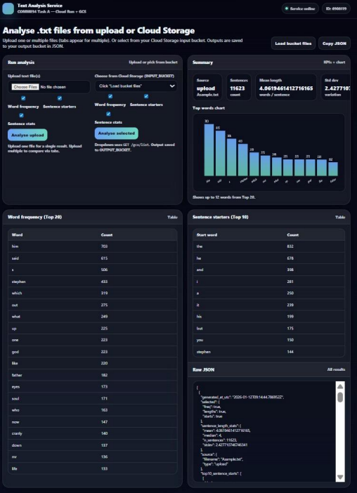
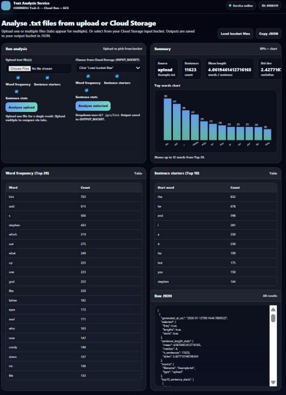
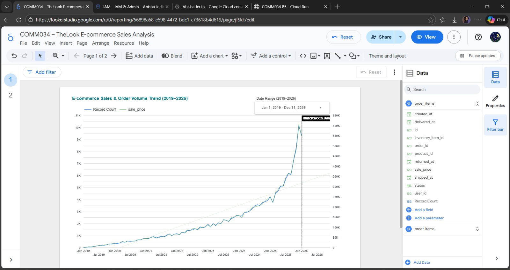
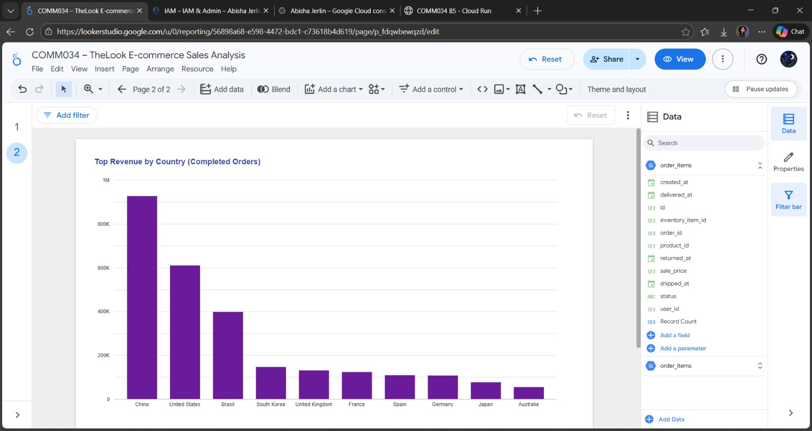
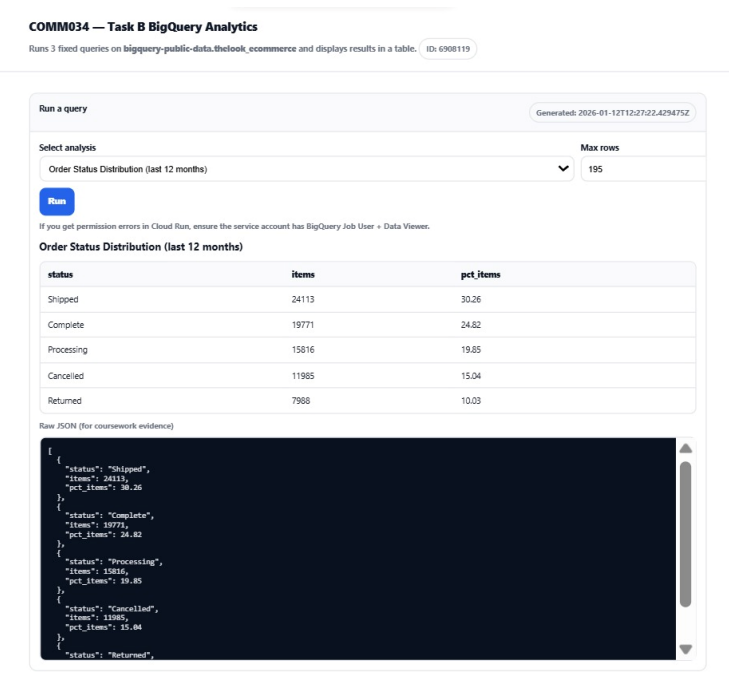
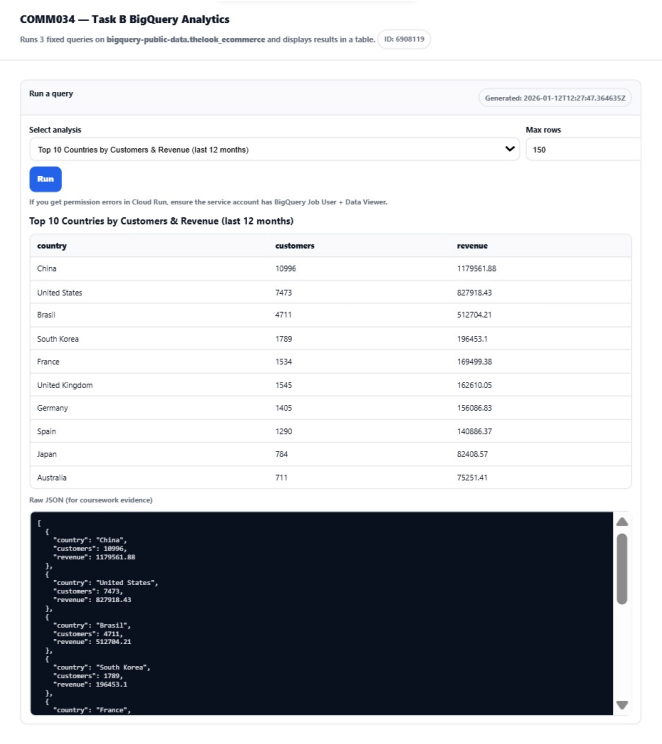

# Serverless Data Analytics on Google Cloud

This repository contains a cloud computing project I built while studying MSc Data Science at the University of Surrey. The aim was to take small data analysis tasks and make them available through simple cloud-hosted services.

The project has two main parts. The first is a Python text analysis API built with Flask. The second is a BigQuery web application that runs predefined analytics queries on Google's public The Look E-commerce dataset. I used Google Cloud Run for deployment and Docker for the BigQuery service.

## What I built

### 1. Text analysis API

The text analysis part processes plain text and returns:

- the 20 most frequent words after removing common stop words
- the 10 most common words used at the start of sentences
- sentence length statistics including mean, median and standard deviation

The analysis logic is kept separate from the Flask API so it can be reused without changing the web layer. The API accepts either an uploaded text file or text sent in JSON format.

### 2. BigQuery analytics web app

The second part connects a Flask application to Google BigQuery. It uses the public `bigquery-public-data.thelook_ecommerce` dataset and lets a user choose a predefined query from a simple browser interface.

The code included in this repository contains queries for:

- top countries by completed-order revenue
- monthly revenue from completed orders

The results are returned from BigQuery and displayed as an HTML table. I containerised this service with Docker so it could be deployed to Google Cloud Run.

## Technologies used

- Python
- Flask
- Google Cloud Run
- Google BigQuery
- Google Cloud Storage
- Docker
- Gunicorn
- HTML and CSS
- Looker Studio

## Project structure

```text
serverless-data-analytics-gcp/
├── text-analysis/
│   ├── analysis_core.py
│   ├── app.py
│   └── requirements.txt
├── bigquery-dashboard/
│   ├── Dockerfile
│   ├── main.py
│   ├── requirements.txt
│   └── templates/
│       └── index.html
├── sample_data/
│   ├── Asample.txt
│   ├── Bsample.txt
│   └── Emma.txt
├── docs/
│   └── images/
├── .gitignore
├── LICENSE
└── README.md
```

## Text analysis API

### Run locally

```bash
cd text-analysis
python -m venv .venv
```

On Windows:

```bash
.venv\Scripts\activate
pip install -r requirements.txt
python app.py
```

The service runs on port `8080` by default.

You can test it with JSON:

```bash
curl -X POST "http://localhost:8080/analyse" \
  -H "Content-Type: application/json" \
  -d '{"text":"This is a short example. This example has two sentences."}'
```

The `/analyse` endpoint also accepts a `.txt` file using multipart form data. The `freq`, `starts` and `lengths` query parameters can be set to `true` or `false` to choose which analyses are returned.

## BigQuery web app

### Requirements

To run the BigQuery part locally, Google Cloud authentication needs to be configured and the account must have permission to run BigQuery jobs.

```bash
cd bigquery-dashboard
python -m venv .venv
```

On Windows:

```bash
.venv\Scripts\activate
pip install -r requirements.txt
gcloud auth application-default login
python main.py
```

Then open `http://localhost:8080` in a browser.

### Run with Docker

```bash
docker build -t bigquery-dashboard .
docker run -p 8080:8080 bigquery-dashboard
```

When deploying to Google Cloud, authentication is handled through the permissions given to the Cloud Run service account rather than putting credentials in the source code.

## Example Outputs

### Text Analysis on Cloud Run



### Multi-file Text Analysis



### Looker Studio Sales Trend



### Revenue by Country



### BigQuery Order Status Analysis



### BigQuery Revenue by Country



## Cloud architecture

During the coursework I also explored using Cloud Storage with Cloud Run for event-driven text processing. The idea was that uploaded text files could be processed independently, allowing the service to scale for multiple files without maintaining a server continuously.

The source code available in this repository focuses on the text analysis API and the BigQuery Cloud Run application. I have kept the repository limited to the code I still have from the project rather than recreating missing coursework files and presenting them as original source code.

## What I learned

This project helped me understand how a local Python analysis can be moved into a cloud environment. I gained practical experience with Flask APIs, Docker containers, serverless deployment, BigQuery SQL, public cloud datasets and presenting query results to users through a basic web interface.

It also showed me why keeping analysis logic separate from the application layer is useful, especially when the same functions may later be reused in another service or processing workflow.

## Notes

This repository is a cleaned portfolio version of my university cloud computing project. Coursework documents, submission files, account details, billing information, duplicate screenshots and large text collections are intentionally not included.

The sample text files are included for testing the text analysis functions with different file sizes.

## License

This project is licensed under the MIT License. The license applies to the source code in this repository. Third-party datasets and services remain subject to their own terms and licences.
